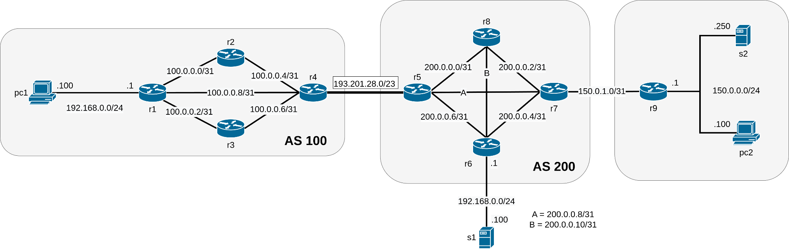

# Network-Infrastructures Project
Network Infrastructures Exam's Project. Simulation with Kathara of the following network topology using different protocols (BGP, OSPF) and custom firewall rules.

# Assignment 

